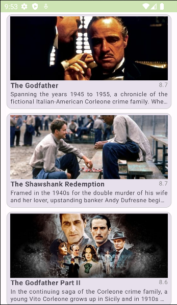

# Movies

The project displays a list of stocks that provides an endpoint.

### Introduction

For this project, the concept of clean architecture is used, which tries to organize the elements
that make up the software design in layers that separate the different concerns of his logic.

The created modules are organized in a way that tells you the right place to develop the code.
Below is a brief description of each of the modules created and their specific use:

- `app` (Android library): Presentation related logic (Activities, Fragments, Components, ViewModels/etc).
- `data` (Android library): Logic related to data processing (Retrofit, StockResponse, RemoteStockDataSource,
  StockRepository, Mapper, etc.).
- `domain` (Pure Java/Kotlin library): Things that represent your business logic, such as (StockModel, FetchStockUseCase,
  StockRepository Interface, etc.).
- `usecase-di`: This is a convenient module used to centralize and satisfy the dependencies used by the project.

The structure of the code in this repo contain the following tools:

- [Basic Modularization](https://android-developers.googleblog.com/2021/12/rebuilding-our-guide-to-app-architecture.html) (app, domain, data layers)
- [Clean Architecture](https://medium.com/android-dev-hacks/detailed-guide-on-android-clean-architecture-9eab262a9011)
- [Coroutines](https://developer.android.com/kotlin/coroutines)
- [Compose](https://developer.android.com/jetpack/compose)
- [Flow](https://developer.android.com/kotlin/flow)
- [Hilt](https://developer.android.com/training/dependency-injection/hilt-android)
- [MockK](https://mockk.io/)
- [Retrofit](https://square.github.io/retrofit/)

This project was created taking inspiration from a previous work called [The movies](https://github.com/camroga/movie).

### UI

when you install the application you will find depending on the response of the end-point the following user interface:

### Install APP

You can find in the [app-stock](app-movies/movies.apk) folder a version of the application
that contains all the behavior required by the challenge.

### Getting Started

* Install [Android Studio](https://developer.android.com/studio/install.html)
* Install [Git](https://git-scm.com/book/es/v2)

### Generating APK

From Android Studio:
1. ***Build*** menu
2. ***Build Bundle(s)/ APK...***